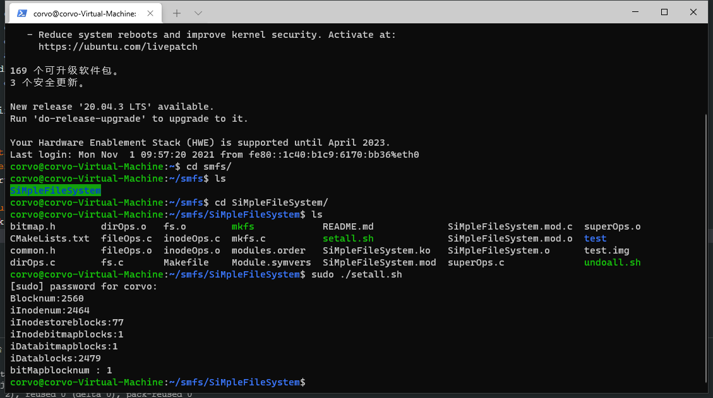
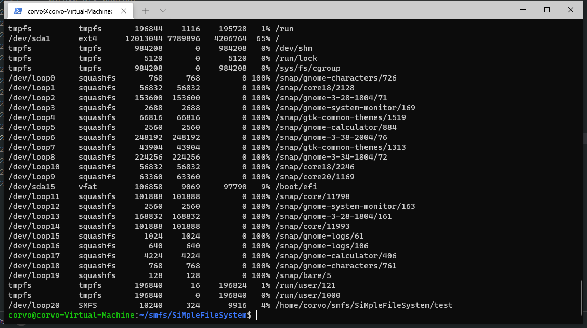
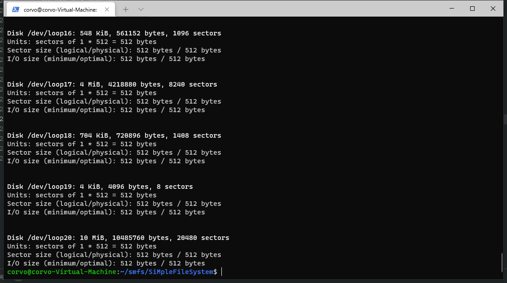
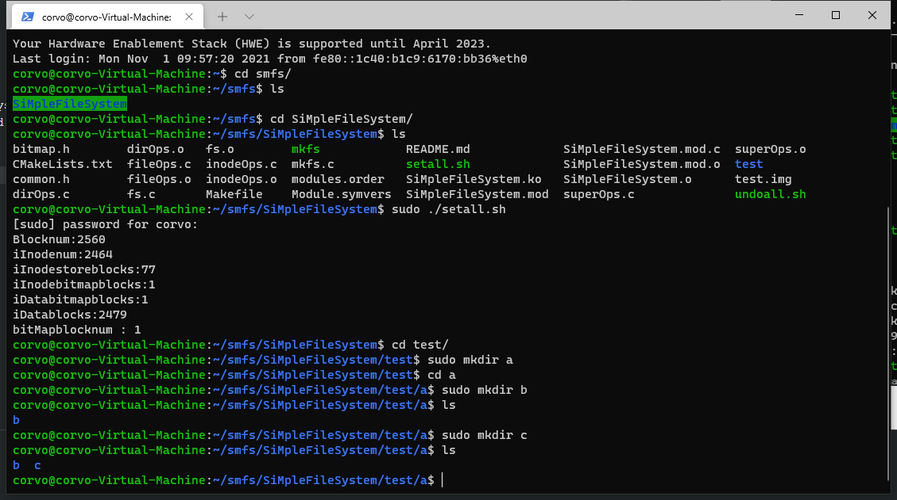
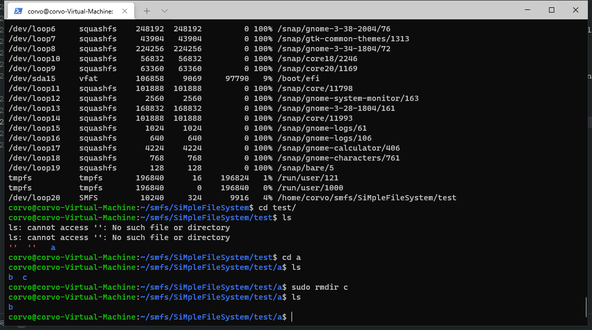
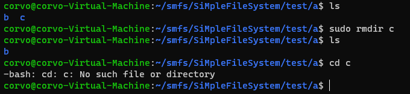
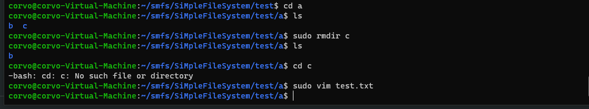
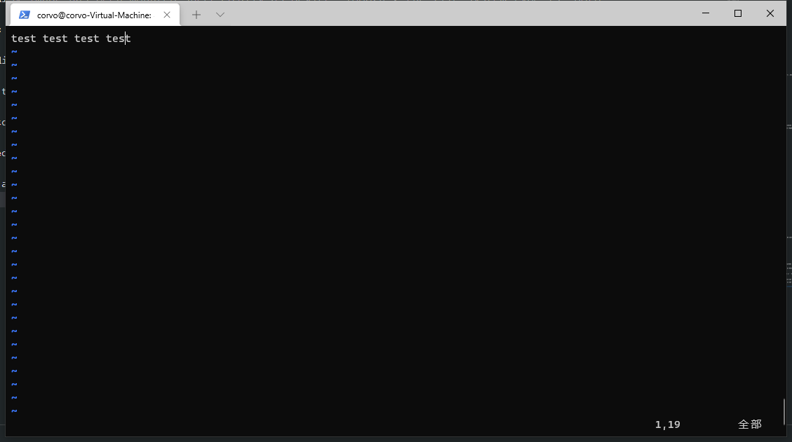
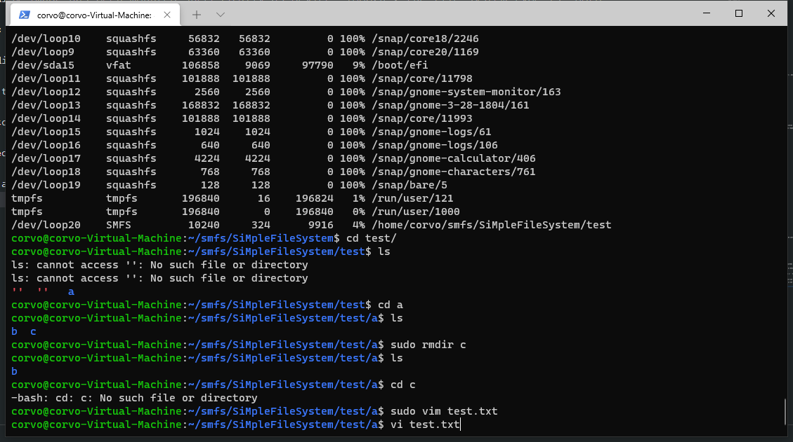
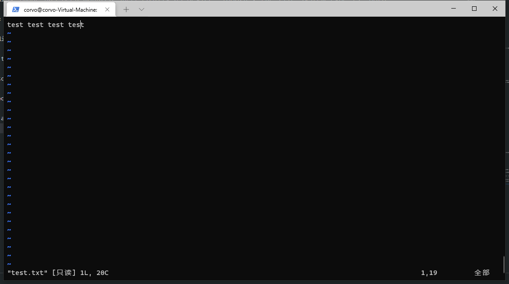

<!--
 * @Author: Corvo Attano(391063482@qq.com)
 * @Description: 
 * @LastEditors: Corvo Attano(fkxzz001@qq.com)
-->
# SiMpleFileSystem
姓名: 姜焱夫
学号：202122080227
## Intro
whole project including 2 parts, the implement of SiMpleFileSystem and a disk formator.  
SiMpleFileSystem is a file system based on POSIX standard, can be installed as a kernel module in Linux.  
disk formator can format disk image, which can be managed by SiMpleFileSystem.  
### Current features
* Dir: create,remove,list
* File: create,read,write
### How to use
* install the linux headers
```shell
sudo apt-get install linux-headers-$(uname -r)
```
* create a directory and a disk image file
```shell
mkdir -p test
dd if=/dev/zero of=test.img bs=1M count=10
```
* build project
```shell
make
```
* install module, format disk image and mount file system
```shell
sudo ./setall.sh
```
* if you want to unmount file system and remove module installed
```shell
sudo ./undoall.sh
```
## Implement Details
### Data Structure  
| section | size(KiB) |
| ----|----|
|super block | 4 |
|inodes | 4n |
|inodes bitmap | 4m |
|blocks bitmap | 4l|
|data blocks | ?|
```
The size of each blocks is 4KiB  
1st block is super block  
n blocks store the inodes  
m blocks is inodes bitmap  
l blocks is block bitmap  
rest of blocks are data blocks  
```
the data structure of super node shows below  
| section | size(B) |
| ----|----|
|Magic | 4 |
|Blocknum | 4 |
|inodenum | 4 |
|inodestoreblocks | 4 |
|inodebitmapblocks | 4 |
|databitmapblocks | 4 |
|inodefree | 4 |
|datafree | 4|

below is the layout of each inode
|inode member | size(B) |
| ---- | ---- |
|mode    | 4|  
|uid     | 4|  
|gid     |4 |
|size    |4 |
|ctime   |4 |
|atime   |4 |
|mtime   |4 |
|blocks  |4 |
|block list/directory pointer| 96  |
|total |128 |

which means the max size of a file is 96B/4B*4KiB=96KiB.  
If the inode store a directory, 

### Disk Formation  
Assume that the blocks in dist is 'B' the number of inode store blocks in a disk is 'x', which means there are x*128 inodes at most. Then we have this equation below:  
```
1+x+ceil(x*32/8/4096)+ceil(x*32/8/4096)+32*x=B

1 superblock
x inodeblocks 
ceil(x*32/8/4096) inode/data bitmap blocks
32x datablocks
```
then we can have `x=floor((B-1)K/(K+64+32K))`, where `K=8*4096=2^15`  
From the equation above, we can design the algorithm of disk formation.  
```
begin
    open disk image
    get disk size
    if disk size < min size
        report error
    fi
    alloc super block
    alloc inode block
    alloc pitmaps
    write the data block 0
end
```

### Super Block Operations
* put_super
release the super block in memory
* alloc_inode
alloc the inode's memory, return the vfs inode
* destroy_inode
release the inode memory
* write_inode
copy the inode data from memory to buffer, and call cache synchronization function
* sync_fs
copy the super block and bitmaps data from memory to buffer, and call cache synchronization function
* statfs
return the file system's information, including magic number, block size,max file name length,etc
### Inode Operations
* lookup
find the dir or file by name, if found append to dentry
```
begin
    check the input name length
    read current directory's data block from page cache
    foreach members in directory do
        if member's name is what we find
            get its inode
            append inode to dentry
        fi
    od
end
```
* create
create dir or file
```
begin
    check name length
    read parent dir data block
    check is parent dir's data block has enough space
    create a new inode and initialize
    if want to create a dir
        alloc new data block to the dir
        clean the data block
    fi
    add the new dentry to parent dir data block
    mark the parent inode, new inode, parent dir's data block dirty
end
```
* mkdir
create a new dir
```
begin
    call create
end
```
* rmdir
remove an empty dir
```
begin
    get the dir's data block
    check is the dir empty
    get the parent dir's data block
    find the dir's location in its parent data block
    delete this dentry and rearrange data block
    mark this dir's inode, its parent inode, and data block dirty
    set the bitmap unuesd
end
```
### Bitmap Operations
* _setBitmap
set a bit in bitmap to 0 or 1 
```
begin
    set byte mask
    targetByte = targetByte &(|) bytemask
end
```
* _findFirstfree
find a unuesd bit(marked by 1) in bitmap
```
begin
    foreach byte in bitmap do
        if byte!=0
            mask=1
            while mask & byte == 0 do
                mask=mask<<1
            od
            return this byte's offset
        fi
    od
end      
```
### Dir Operations
* iterate_shared
this function return the iteration of dir entries(including '.' and '..') which will be called by 'ls'
```
begin
    check is current inode type DIR
    check is current dir context position less than max position
    read the dir's data block
    emit '.' and '..'
    foreach dir entries in data block do
        fill dir context
    od
    return dir context
end
```
### File Operations
the write and read functions are based on page cache.  
getBlock function will mapping the i-th block to page cache buffer
* _getBlock
```
begin
    check if the block index is too big
    if this block has not been allocted and "create" flag is true
        alloc new data block and mark it on bitmap
        set file inode's data block pointers
    fi
    map the block and buffer
end
```
## Experiments
### environment
* Hyper-v virtual machine
* OS version : Ubuntu 18.04.3 LTS (GNU/Linux 5.4.0-89-generic x86_64)
### Test results
* Create a empty directory and a disk image files and mount SiMpleFileSystem on them
(the setall.sh will install the kernel module, format the disk image and mount file system)
You can see mkfs report the disk image's formatting results.

Enter instruction```df -T``` we can see the disk image has been mounted successfully as device "loop20", the file system type is "SMFS".

Use ```sudo fdisk -l``` to check the device's information

* Enter the "test" directory, use ```sudo mkdir a```to create a sub dir "a",use ```cd a``` to enter this dir, and use ```sudo mkdir b``` ```sudo mkdir c``` to create the sub directories of "a"
then enter instruction ```ls``` to check out the two sub dir of "a"

* We can use instruction ```sudo rmdir c``` to remove dir "c",and use ```ls``` to check out the directories after the operation.

to ensure, try ```cd c``` to enter the deleted dir. As we can see, the directory "c" is not exist at all.

* Then use ```sudo vim test.txt``` to create and write a new file


saving the file and exit,then use ```vi test.txt``` to see what we write

